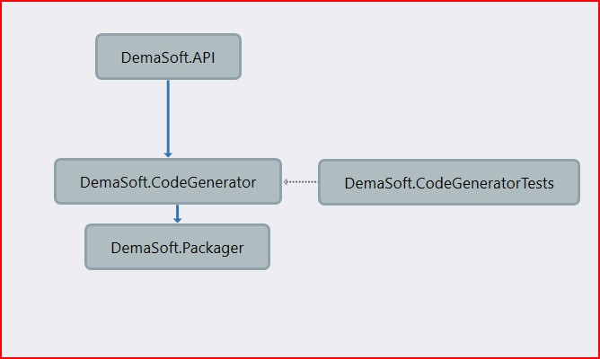

# DemaSoft.API - API Architecture README

 This README provides an overview of the C# API architecture utilizing the strategy pattern, dependency injection, NSwag code generation, and packaging with NuGet. This architecture is designed to process an Open API specification file and generate code.

 The code will take an API (swagger) Json format file and process it. To be able to test the Lord Of the Rings API, the 2 endpoints movie and quote responses were translated to API swagger manually.

## Project Overview

This project showcases a flexible and extensible architecture for building APIs that generate and compile code using various libraries and packagers. The architecture consists of three main projects:

1. **API Project**: This project defines the API endpoints and orchestrates the code generation and packaging process. It leverages dependency injection to swap out code generation and packaging strategies.

2. **Code Generator Project**: This project houses the logic to parse the Open API specification file and generate code. It implements a strategy pattern allowing different code generation libraries to be plugged in.

3. **Packager Project**: This project handles the packaging of generated code into NuGet packages (and potentially other formats). Similar to the code generator, this project also utilizes the strategy pattern for extensibility.

4. **DemaSoft.CodeGeneratorTests Project**: This project handles the unit test. There are 2 units that exercise the C# compilation code. One positive test that ensure that the compilation of the code generated from the code generator does indeed works. A negative test which introduce a compilation error into the code being compiled will ensure that the code fails.

## High Level Architecture

